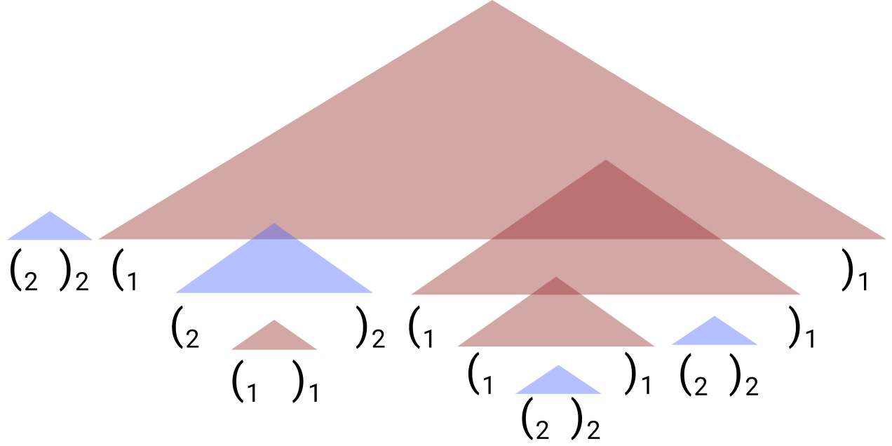

  

# dyckkm-learning
Internal repository for implementing LMs and data generation scripts for learning the Dyck-(k,m) languages of bounded hierarchical tructure.

This code implements experiments found in

> RNNs can generate bounded hierarchical structure with optimal memory.  
> John Hewitt, Michael Hahn, Surya Ganguli, Percy Liang, Christopher D. Manning  
> Empirical Methods in Natural Language Processing (EMNLP) 2020.  

Also check out [Codalab](https://worksheets.codalab.org/worksheets/0xd668cf62e9e0499089626e45affee864) for reproducibility, where the code and data for each experiment in the paper is available in immutable form.

## _m_-bounded Dyck-_k_

## Installing and getting started

1. Clone the repository.

        git clone https://github.com/john-hewitt/rnns-stacks-internal/
        cd rnn-stacks-internal
        
1. [Optional] Construct a virtual environment for this project. Only `python3` is supported.

        conda create --name rnn-env
        conda activate rnn-env

1. Install the required packages.

        conda install --file requirements.txt

1. Generate some samples from a Dyck-(k,m) distribution. This'll print out where the samples are written to, so take a look at the data! The only argument to the python script is the path to an experiment config file, the details of which we'll get into later.

        python rnns-stacks/generate_mbounded_dyck.py configs/emnlp2020/languages/dyckkm_m3_k2_trainc2000.yaml
        
1. Try training an LSTM LM on the samples you just generated. You'll use the same experiment config file you used in generating the samples. This script will print out the location of some statistics of evaluation.

        python rnns-stacks/run_lm.py configs/emnlp2020/experiments/lmLSTM_seed0_m3_k2_trainc2000.yaml

1. Look in `configs/` for other configuration files. Each experiment on learning Dyck-(k,m) in the paper corresponds to one of these configuration files.

## The config file for specifying experiments
This repository exclusively uses `yaml` configuration files for specifying each experiment.
Here's an explanation of what each part of the `yaml` configs means:

The first portions specify the datasets' locations and properties of the specific Dyck-(k,m) language.
For generating data with `rnns-stacks/generate_mbounded_dyck.py`, only this portion is needed.
 - `corpus`:
    - `train_corpus_loc`: The filepath for the training corpus
    - `dev_corpus_loc`: The filepath for the development corpus
    - `test_corpus_loc`: The filepath for the test corpus
- `language`:
    - `train_bracket_types`: The number of unique bracket types, also _k_ in Dyck-(k,m) for the training set.
    - `train_max_length`: The maximum length of any training example 
    - `train_min_length`: The minimum length of any training example 
    - `train_max_stack_depth`: The maximum number of unclosed open brackets at any step of a training example
    - `train_sample_count`: Number of samples in tokens (!!) not lines, for the training set.
    - `dev_bracket_types`: The number of unique bracket types in the development set, also _k_ in Dyck-(k,m).
    - `dev_max_length`: The maximum length of any development example 
    - `dev_min_length`: The minimum length of any development example 
    - `dev_max_stack_depth`: The maximum number of unclosed open brackets at any step of a development example
    - `dev_sample_count`: Number of samples in tokens (!!) not lines, for the development set.
    - `test_bracket_types`: The number of unique bracket types, also _k_ in Dyck-(k,m) for the test set.
    - `test_max_length`: The maximum length of any test example 
    - `test_min_length`: The minimum length of any test example 
    - `test_max_stack_depth`: The maximum number of unclosed open brackets at any step of a test example
    - `test_sample_count`: Number of samples in tokens (!!) not lines, for the test set.

Note that running an experiment training an LM with a specific `corpus` and `language` configuration doesn't generate the corresponding dataset; instead, you should first run  `rnns-stacks/generate_mbounded_dyck.py` to generate the dataset, and then use `rnns-stacks/run_lm.py` to train and evaluate the LM.

The next portions of the `yaml` configuration files is for specifying properties of the LSTM LMs.

- `lm`: 
     - `embedding_dim`: The dimensionality of the word embeddings.
     - `hidden_dim`: The dimensionality of the LSTM hidden states.
     - `lm_type`: Chooses RNN type; pick from RNN, GRU, LSTM.
     - `num_layers`: Chooses number of stacked RNN layers
     - `save_path`: Filepath (relative to reporting directory) where model parameters are saved.
 - `reporting`: 
     - `reporting_loc`: Path specifying where to (optionally construct a folder, if it doesn't exist) to hold the output metrics and model parameters.
     - `reporting_methods`: Determines how to evaluate trained LMs. `constraints` provides an evaluation metric determining whether models know which bracket should be closed, whether the sequence can end, and whether an open bracket can be seen at each timestep.
 - `training`: 
     - `batch_size`: Minibatch size for training. Graduate student descent has found that smaller batches seems to be better in general. (100: too big. 1: maybe the best? But very slow. 10: good)
     - `dropout`: Dropout to apply between the LSTM and the linear (softmax matrix) layer constructing logits over the vocabulary.
     - `learning_rate`: Learning rate to initialize Adam to. Note that a 0.5-factor-on-plateau decay is implemented; each time the learning rate is decayed, Adam is restarted.
     - `max_epochs`: Number of epochs after which to halt training if it has not already early-stopped.
     - `seed`: Doesn't actually specify random seed; used to distinguish multiple runs in summarizing results. Maybe should have specified random seeds, but wouldn't replicate across different GPUs anyway...

## Code layout
- `generate_mbounded_dyck.py`: Code for generating samples from distributions over Dyck-(k,m).
- `run_lm.py`: Code for running experiments with `yaml` configs.
- `rnn.py`: Classes for specifying RNN models.
- `lm.py`: Classes for specifying probability distributions given an encoding of the sequence.
- `dataset.py`: Classes for loading and serving examples from disk.
- `training_regimen.py`: Script for training an LM on samples
- `reporter.py`: Classes for specifying how results should be reported on a given experiment.
- `utils.py`: Provides some constants (like the Dyck-(k,m) vocabulary) as well as paths to corpora and results.
- `make_emnlp2020_plot.py`: Generates the plot seen in Figure 3 of the main paper; it's in this directory because it uses `utils.py` to get results locations.
